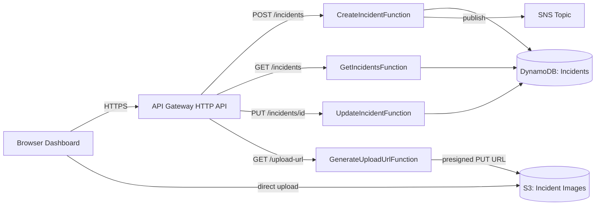

# Cloud Disaster Response System

A serverless application for reporting and tracking disaster incidents (floods, fires, earthquakes, etc.) in real time. Citizens submit incidents with a photo through a web dashboard; responders track status as reports move from `OPEN` → `IN_PROGRESS` → `RESOLVED`, and the team is notified by SNS the moment a new incident comes in.

Built entirely on AWS managed services with infrastructure defined as code and deployed via GitHub Actions on every push to `main`.

## Architecture



**Flow:** the browser first asks `GenerateUploadUrlFunction` for a presigned S3 URL, uploads the photo directly to S3 (never through the Lambda), then calls `CreateIncidentFunction` with the resulting file key. The incident is written to DynamoDB and an SNS notification fires immediately. Responders update status via `PUT /incidents/{id}`, and the dashboard polls `GET /incidents` to render the live list.

## Tech stack

| Layer | Technology |
|---|---|
| Compute | AWS Lambda (Python 3.12) |
| API | Amazon API Gateway (HTTP API) |
| Database | Amazon DynamoDB |
| Object storage | Amazon S3 (presigned uploads) |
| Notifications | Amazon SNS |
| Infrastructure as Code | AWS CloudFormation |
| CI/CD | GitHub Actions |
| Frontend | Vanilla HTML/CSS/JS (no build step) |
| Testing | pytest, `unittest.mock` |

## Project structure

```
backend/           Lambda function source (one file per handler)
frontend/          Static dashboard (index.html, self-contained)
infrastructure/    CloudFormation template defining all AWS resources
tests/             pytest unit tests for the Lambda handlers
.github/workflows/ CI/CD pipeline (test -> deploy stack -> package -> ship)
```

## API reference

| Method | Path | Handler | Description |
|---|---|---|---|
| `POST` | `/incidents` | `create_incident.py` | Create an incident, publish an SNS alert |
| `GET` | `/incidents` | `get_incidents.py` | List all incidents |
| `PUT` | `/incidents/{id}` | `update_incident.py` | Update status / assigned volunteer |
| `GET` | `/upload-url` | `generate_upload_url.py` | Get a presigned S3 URL for a photo upload |

Example — reporting an incident:

```bash
curl -X POST "$API_URL/incidents" \
  -H "Content-Type: application/json" \
  -d '{"type": "Flood", "description": "Water rising near harbor", "location": "Halifax", "fileKey": "optional-s3-key.jpg"}'
```

## Running tests

The Lambda handlers are unit tested with mocked AWS clients (no real AWS calls, no `moto` dependency needed):

```bash
pip install -r requirements-dev.txt
pytest -q
```

## Deployment

Deployment is fully automated: every push to `main` triggers [.github/workflows/deploy.yml](.github/workflows/deploy.yml), which runs the test suite, deploys [infrastructure/template.yaml](infrastructure/template.yaml) via CloudFormation, packages and uploads the Lambda code, and syncs the frontend to S3.

To deploy manually:

```bash
aws cloudformation deploy \
  --template-file infrastructure/template.yaml \
  --stack-name disaster-response-stack \
  --capabilities CAPABILITY_NAMED_IAM \
  --region ca-central-1
```

Required GitHub Actions secrets: `AWS_ACCESS_KEY_ID`, `AWS_SECRET_ACCESS_KEY`, `AWS_SESSION_TOKEN` (temporary-credential AWS Academy environment).

## Known limitations / production considerations

This was built as a learning project, so a few things are simplified on purpose:

- **CORS is wide open** (`AllowOrigins: "*"`) on the API and the image bucket, to keep local development friction-free. In production this should be scoped to the dashboard's actual origin.
- **No authentication** — anyone with the API URL can create or update incidents. A production version would put this behind Cognito or IAM auth.
- **No rate limiting / WAF** in front of API Gateway.

## License

[MIT](LICENSE)
